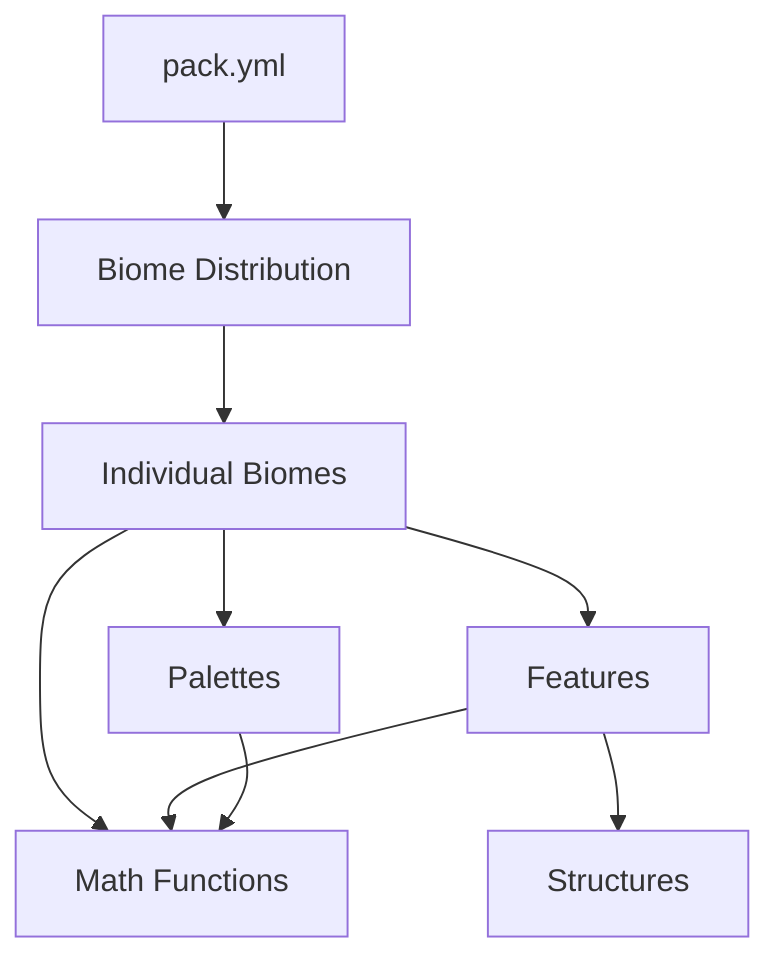

## Introduction

Origen uses a highly modular configuration system that separates different aspects of world generation into distinct directories. This structure makes it easy to understand, modify, and extend the pack's behavior.

## Directory Structure

The configuration pack is organized into several top-level directories, each handling a specific domain:

<AccordionGroup>
  <Accordion title="biomes/">
    Contains all biome configuration files. Each biome defines its terrain generation parameters, features, palettes, and other properties.
    
    - Individual biome configs (e.g., `OCEAN.yml`, `FOREST.yml`)
    - Abstract base configs for inheritance
    - Biome-specific feature configurations
  </Accordion>

  <Accordion title="biome-distribution/">
    Defines **where** biomes generate in the world. Contains the biome placement pipeline.
    
    - `presets/` - Complete biome distribution configurations
    - `stages/` - Pipeline stages for biome placement
    - `extrusions/` - Cave and underground biome placement
    
    See [Biome Distribution Reference](/reference/biome-distribution) for details.
  </Accordion>

  <Accordion title="features/">
    Contains feature configurations that determine **how** structures are generated in the world.
    
    - `vegetation/` - Trees, flowers, bushes, coral
    - `deposits/` - Ore veins and mineral deposits
    - `boulders/` - Boulder placement
    - `misc/` - Special features like travertine and volcanoes
    
    See [Features Reference](/reference/features) for details.
  </Accordion>

  <Accordion title="structures/">
    Contains the actual structure files loaded into the world (`.tesf`, `.tobj`, etc.).
    
    - Mirrors the organization of `features/`
    - Trees, boulders, flower patches, fossils
    - Structure files reference by feature configs
    
    See [Structures Reference](/reference/structures) for details.
  </Accordion>

  <Accordion title="palettes/">
    Defines block composition for terrain generation.
    
    - Organized by environment type (arid, temperate, cold, etc.)
    - Determines what blocks make up the base terrain
    - Used by biomes for surface composition
    
    See [Palettes Reference](/reference/palettes) for details.
  </Accordion>

  <Accordion title="math/">
    Contains reusable mathematical functions and noise samplers.
    
    - `functions/` - Terrace, interpolation, clamping functions
    - `samplers/` - Terrain, continents, rivers, temperature
    - Referenced throughout the pack for calculations
    
    See [Math Functions Reference](/reference/math-functions) for details.
  </Accordion>
</AccordionGroup>

## How Configs Relate

The configuration system follows a clear hierarchy:



### Configuration Flow

1. **pack.yml** - The root configuration file that:
   - Selects the biome distribution preset
   - Defines generation stages (ores, trees, flora, etc.)
   - Imports math functions and samplers

2. **Biome Distribution** - Determines biome placement:
   - Uses cellular noise for biome cells
   - Applies pipeline stages to refine placement
   - Adds special features (rivers, canyons, caves)

3. **Individual Biomes** - Each biome config:
   - References palettes for terrain composition
   - Lists features for each generation stage
   - Uses math samplers for terrain shaping

4. **Features** - Control structure generation:
   - Define placement rules (distributors, locators)
   - Reference structure files to place
   - Use noise samplers for variation

5. **Structures** - The actual world objects:
   - Loaded from structure files
   - Placed according to feature configs
   - Can be procedural or pre-built

## File Organization Principles

### Modular Design

Origen follows a modular approach where:
- Common elements are defined once and reused
- Inheritance reduces duplication
- YAML anchors (`<<`) merge configurations

```yaml
# Example: Merging math functions
functions:
  "<<":
    - math/functions/terrace.yml:functions
    - math/functions/interpolation.yml:functions
```

### Directory Naming

- **Base directories** - Broad categories (features, structures, palettes)
- **Subdirectories** - Specific types (vegetation, deposits, arid)
- **`rearth/` folders** - Original Origen content not in vanilla Terra

### Configuration References

Configs can reference other files using:

```yaml
# Reference external config
biomes: $biome-distribution/presets/rearth.yml:biomes

# Reference variable from another file
frequency: 1 / ${customization.yml:biomeSpread.cellDistance}

# Merge entire section
stages:
  - << biome-distribution/stages/oceans.yml:stages
```

## Special Directories

### Abstract Configs

Many directories contain an `abstract/` subdirectory with base configurations:

- `biomes/abstract/` - Base biome configs for inheritance
- Feature groups organized by generation stage
- Reduces duplication across similar biomes

### Rearth Content

Directories with `rearth/` subdirectories contain original Origen content:

```
features/rearth/
structures/rearth/
  ├── fossils/
  └── giant_sakura/
```

This makes it easy to identify new content versus Terra defaults.

## Configuration Files

### Root-Level Files

<CardGroup cols={2}>
  <Card title="pack.yml" icon="box">
    Main pack configuration - biome provider, generation stages, functions
  </Card>
  <Card title="meta.yml" icon="sliders">
    Metadata and common variables used throughout the pack
  </Card>
  <Card title="customization.yml" icon="wrench">
    User-facing settings for easy customization (biome sizes, scales, etc.)
  </Card>
  <Card title="README.md" icon="book">
    Documentation about the pack structure and biomes
  </Card>
</CardGroup>

## Next Steps

Explore the detailed reference documentation for each configuration domain:

<CardGroup cols={2}>
  <Card title="Biome Distribution" icon="map" href="/reference/biome-distribution">
    Learn how biomes are placed in the world
  </Card>
  <Card title="Features" icon="tree" href="/reference/features">
    Understand feature generation and placement
  </Card>
  <Card title="Palettes" icon="palette" href="/reference/palettes">
    Explore block composition systems
  </Card>
  <Card title="Structures" icon="cubes" href="/reference/structures">
    Discover structure file organization
  </Card>
  <Card title="Math Functions" icon="calculator" href="/reference/math-functions">
    Reference for samplers and functions
  </Card>
</CardGroup>
